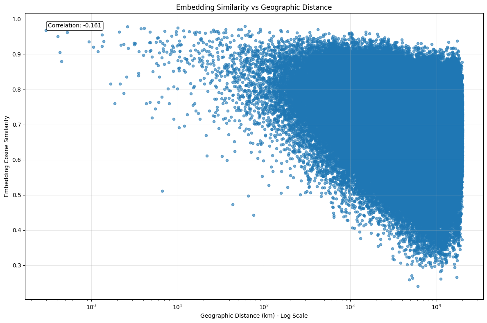
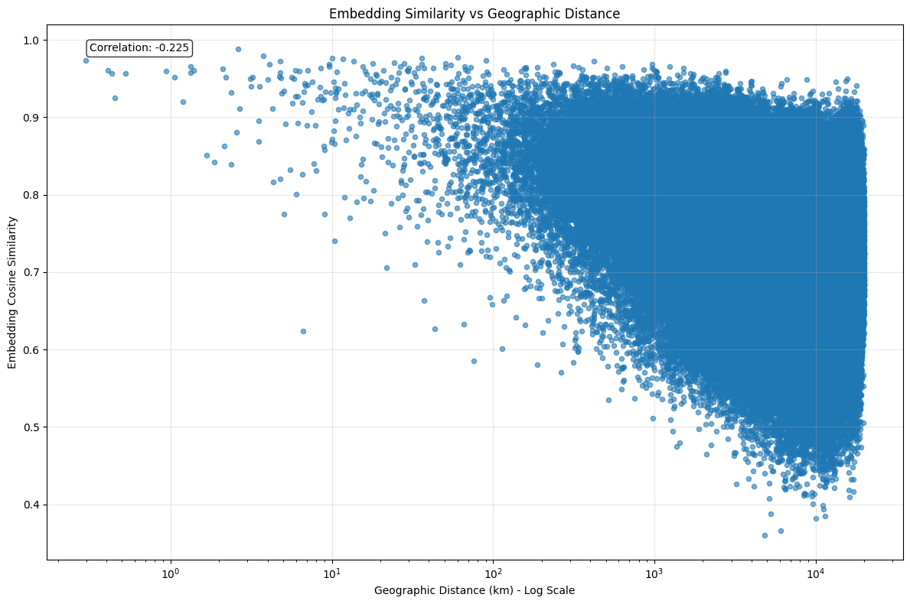

# Geosolver
How good are deep learning networks at playing [Geoguessr](https://www.geoguessr.com/)?

# Once upon a time
There is a game called GeoGuessr that became pretty popular over the last decade and I really enjoy watching the championships where the best players try to guess the exact geographical location looking at the StreetView image from Google. I also enjoy training deep learning models 🙂 When these two interests came together in my mind, the idea of this project was born. 

To be honest, there is not that much of a motivation for this project, so I’m going to treat it as a fun, though very interesting pet project. On the other hand, the problem of geolocation based on an image has some useful applications. 

The goal of the project is to create a deep learning model that will be capable of predicting geographical location given an image of that place.

Creation of such a model from scratch would be a very expensive and complex task, therefore, I’m going to use all available pre-trained models and data that might be useful to achieve the goal.

One such model is “StreetCLIP”, a CLIP model fine-tuned for geolocation, which is already a decent model for geolocation. Will I be able to push it to perform even better?

Now, as the model choice is naturally done at this point, there are 2 things that need to be handled before fine-tuning:
1. Data
2. Optimization objective

The amount and quality of the data is definitely important, but I don’t expect any obstacles related to gathering more samples, suitable for fine-tuning.

Optimization objective is what I care about much more, as it is not an obvious decision at all. There is actually a lot of research related to training and fine-tuning for geolocation and I expect to see more in the near future. This project doesn’t present itself as a proper, serious academic research, so I want to waive any expectations for the reader as soon as possible. On the other hand, this project is not a regular “paper implementation”, as I truly strive to come up with something innovative, because I like the challenge. I will do my best to log my thoughts, reflections and findings as I make progress towards the goal of the project.

Getting back to the “Optimization objective” topic. According to my research, the vast majority of papers approach the task of geolocation as either classification or retrieval. The classification approach tasks the model to predict the location, given the image. As the number of possible exact locations is huge, researchers usually come up with some ways to aggregate locations into areas and predict those instead. I’m not going to dive deep into details of this approach, because I’m personally much more excited about the retrieval approach. Why? I don’t really have any satisfying justification, even for myself. To the best of my knowledge, there is no such a paper that would prove either of these two approaches to be superior. The reason why I’m more interested in retrieval approach is because I find it very elegant when model creates meaningful high-dimensional representations of geographical locations.

## EMA: Explorational Model Analysis
As previously mentioned, we won’t start from pre-trained model, but instead use already fine-tuned model for geolocation called StreetCLIP.

Now, how good is it? Maybe it is so good we won’t need do anything? 🙂

Lets conduct a brief testing of StreetCLIP to understand its capabilities. 

Before thinking about any evaluation pipelines, the first thing I would like to see is a distribution of the cos similarity between embeddings as well as the correlation between cos distance and real-world distance. I’m using a sub-set of osv5m dataset that contains images and their GPS coordinates.

### Cosine Similarity vs Real-World Correlation

CLIP: Cosine Similarity vs Real-World Correlation

StreetCLIP: Cosine Similarity vs Real-World Correlation

The plots above shows the correlation between cosine distance and real-world distance. The correlation is not very strong, but it is still there and it entails that models should be able to capture some of the geographical relationships.

StreetCLIP correlation value suggests better alignment.
Plots show that both CLIP and StreetCLIP have a lot of pairs where similarity is very high but real-world distance is huge (right upper corner).

> How would the scatter plot look like for an “ideal” model? **It would be a strictly decreasing curve.**

Notice how the mean of cos sim strictly decreases with increasing real-world distance. Such a curve would be one of the “ideal” models. Maybe pre-training and fine-tuning already decided on such a curve that corresponds to an “ideal” model and the mean of cos sim is an approximation. What if we set an optimization objective that reduces deviations of cos sim from the mean? The idea sounds silly, but why not give it a chance? My main concern about this idea is that the model might be very unstable during the fine-tuning and might eventually collapse.

### Cosine Similarity Distribution

What would be the mean of the cos similarity between uniformly distributed embeddings?

> When vectors are uniformly distributed on a unit hypersphere in d-dimensional space, the expected dot product (which equals cosine similarity for unit vectors) is: $E[cos(θ)] = E[u · v] = 0$

In reality, the average is around 0.7 for both CLIP and fine-tuned StreetCLIP. But does it give us any useful information? Higher average doesn’t mean that model is good, as **dimensional collapse** or the **cone effect** may be present.

## Evaluation

### Metric
Evaluation metric is 
$$\text{Geoscore} = 5000 \cdot \exp\left(-\frac{\delta}{1492.7}\right)$$
, where δ is Haversine distance between the predicted and the actual location in kilometers. The metric is designed to be similar to the one used in GeoGuessr, where the maximum score is 5000 and the minimum is 0.

### Dataset
I want to gather a small but representative dataset that will be used to run K-NN during the evaluation. Dataset should cover the whole planet and be diverse in terms of different geo features. 

For each lon/lat cell, take all the images within the cell, embed the images and cluster embeddings. Sample from each cluster in a round-robin fashion until the desired number of images is reached. This way we get a balance between global coverage and local diversity.

> Clarification on the local diversity: Imagine a lon/lat cell somewhere in Syberia where 99% percent of cell’s area is a forest and 1% is a water. Both in random and uniform sampling across the cell’s area we might get forest images exclusively, thus missing the whole type of land cover, which lowers the representativeness of the final dataset. When using the clustering of images embeddings, I expect forest images and water images to be in a separate clusters, each used for sampling.  
> Note: the example above illustrates the diversity of the land cover type, but clustering of embeddings can provide many more “geo feature” dimensions, assuming we use an embedding model that was already fine-tuned for geo location (e.g. StreetCLIP).

UPD: If the number of images witin a cell is huge and dataset has useful geo features, then we can first split the cell into groups based on the combination (product) of geo features. For example, if we have a cell with 1000 images, we can split it into groups, where each group has a different combination (product) of geo features (e.g. land cover type, climate, soil type, etc.). Then, if the number of images in a group is still big enough we can use clustering for images within each group.

There are 23007 unique combinations of `cell`, `land_cover`, `climate`, and `soil` present in `osv5m/test` dataset with at least one image associated with them. The number of images in each group varies, and the distribution is as follows:
| Number of images in group | Group count |
|---------------------------|-------|
| 1                         | 6197  |
| 2-3                       | 5585  |
| 4-10                      | 5962  |
| 11-20                     | 2551  |
| 21-50                     | 2017  |
| 51-100                    | 587   |
| 101-150                   | 96    |
| >150                      | 12    |

This table shows the distribution of the number of images for each unique combination of `cell`, `land_cover`, `climate`, and `soil` present in `osv5m/test` dataset. For example, the first row indicates that there are 6197 unique combinations of these features that have 1 image associated with them. The last row shows that there are 12 combinations with more than 150 images.
